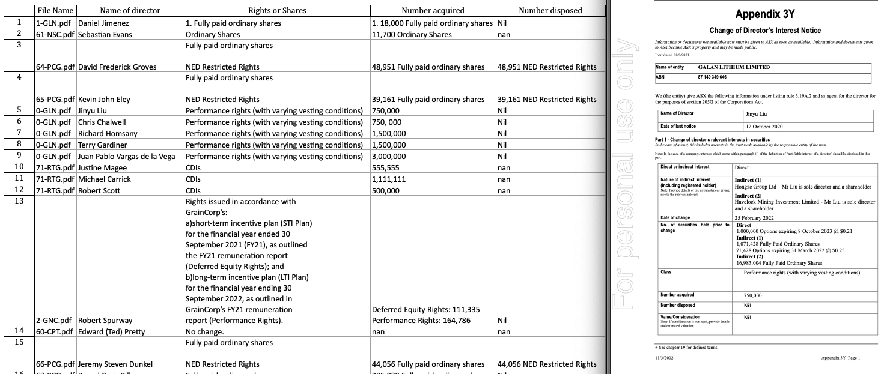

# ASX-Announcements

### Background

The Australian stock exchange requires listed companies to inform the market whenever their directors transact in company shares. Directors buying (selling) shares is a potential buy (sell) signal for investors because directors, as company insiders, presumably have a strong understanding of the company's future profitability. The company must lodge an announcement to the market titled an 'Appendix 3Y  - Change in Director's Interest Notice' through the Australian stock-exchange website within five business days of the transaction. 

### Problem

The information found in ASX announcements, such as the 'Appendix 3Y', are not made readily available to investors in a database. Instead, information on each director's transaction is a .pdf with difficult to extract fields, each stored separately behind a website link, and among a sea of irrelevant announcements. 

### Solution

Python scripts to download all of the current day's announcement files, extract details of director's transactions, and save as a workbook.  

**ASX_Announce_Scraper.py** 
- Downloads a list of the current day's ASX announcements, found here: https://www.asx.com.au/asx/v2/statistics/todayAnns.do. Uses BeautifulSoup package. 
- Isolates announcements with the title '3Y' or 'Change of Director's Interest Notice', navigates to the announcement's pdf link, and downloads the file. Uses Selenium (geckodriver + Firefox) and PyAutoGui packages.

**3Y_Announce_PDF_Extractor.py**

- Extracts relevant details from each announcement's .pdf file, including: 'Name of director', 'Number acquired', 'Number disposed', and 'Class' (rights/shares), and saves as an excel file. Uses Tabula package. 

*Pictured - Left: the output from the Python scripts, an Excel summary of each director's transaction. Right: an example 'Appendix 3Y' announcement.

**Environment**

- requests==2.27.1
- selenium==4.1.2
- tabula-py==2.3.0
- PyAutoGUI==0.9.53
- pandas==1.2.4
- numpy==1.20.2
- openpyxl==3.0.9
- beautifulsoup4==4.10.0
